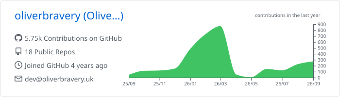
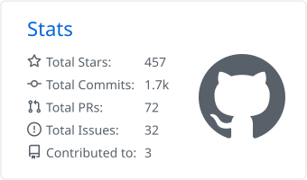
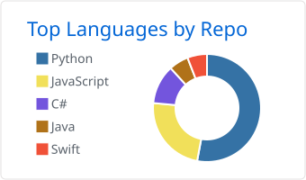

  

# Oliver Bravery

Backend software engineer building accessible AI solutions with edge computing.

England - SW

 

   

## About

I build accessible AI solutions with an emphasis on edge computing, alongside the reliable backend systems that serve them. I'm a computer science graduate of Newcastle University, where my research on few-shot fault detection for 3D printing became the model behind PrintGuard.

## Tech stack

<table align="center">
  <tr>
    <td align="right">Languages</td>
    <td>
      
      
      
      
      
    </td>
  </tr>
  <tr>
    <td align="right">Datastores</td>
    <td>
      
      
      
    </td>
  </tr>
  <tr>
    <td align="right">Infrastructure</td>
    <td>
      
      
    </td>
  </tr>
</table>

## Projects

<table>
  <tr>
    <td width="50%" valign="top">
      <h3 align="center"><a href="https://github.com/oliverbravery/PrintGuard">PrintGuard</a></h3>
      

      
Catches failed 3D prints on your own hardware, pauses the printer and sends you a snapshot alert. Runs in your browser, in Docker or as a macOS or Windows app, and no frame ever leaves your network.

      

        
        
        
        
      

    </td>
    <td width="50%" valign="top">
      <h3 align="center"><a href="https://github.com/oliverbravery/Edge-FDM-Fault-Detection">Edge FDM Fault Detection</a></h3>
      

      
The training and evaluation code behind my research paper on few-shot, real-time fault detection for additive manufacturing on edge devices.

      

        
        
      

    </td>
  </tr>
  <tr>
    <td width="50%" valign="top">
      <h3 align="center"><a href="https://github.com/oliverbravery/OpenAuth">OpenAuth</a></h3>
      

      
An OAuth 2.0 compliant authentication and authorisation service built with FastAPI and MongoDB, implementing the Authorization Code flow with PKCE.

      

        
        
        
      

    </td>
    <td width="50%" valign="top">
      <h3 align="center"><a href="https://github.com/oliverbravery/FourthShiftSync">FourthShiftSync</a></h3>
      

      
A Safari extension that adds a Sync button to Fourth's My Schedule page, copying your shifts into Apple Calendar and a Google Sheet.

      

        
        
        
      

    </td>
  </tr>
</table>

The rest is on my [repositories page](https://github.com/oliverbravery?tab=repositories).

## GitHub stats

  <picture>
    <source media="(prefers-color-scheme: dark)" srcset="profile-summary-card-output/github_dark/0-profile-details.svg">
    
  </picture>
  <picture>
    <source media="(prefers-color-scheme: dark)" srcset="profile-summary-card-output/github_dark/3-stats.svg">
    
  </picture>
  <picture>
    <source media="(prefers-color-scheme: dark)" srcset="profile-summary-card-output/github_dark/1-repos-per-language.svg">
    
  </picture>

## Get in touch

The quickest way to reach me is [email](mailto:dev@oliverbravery.uk). I write about what I build on [Medium](https://medium.com/@oliverbravery) and post the rest here or on [LinkedIn](https://www.linkedin.com/in/olibravery/).

---

Last updated: 25-08-2026

